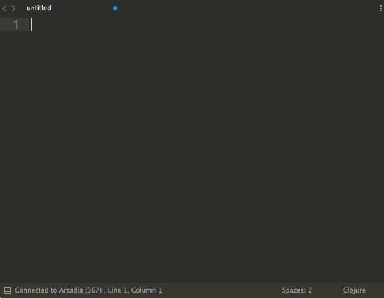

Sublime Sockets
===============
Socket REPL support for Sublime Text 3



Status
------
Alpha. Subject to change.

Usage
-----
Sublime Sockets sends text from Sublime Text buffers to processes listening on the network. It is designed to enable live coding in [Arcadia](https://github.com/arcadia-unity/Arcadia) and [Nostrand](github.com/nasser/nostrand), but it is language agnostic and can be used with any network based tool.

### Socket Buffers
A connection between Sublime Text and a network processes is represented by a *socket buffer*. Socket buffers are created with the `Socket: New` command. You will be prompted to enter the host and port of the process you want to communicate with. Socket buffers by default sit under the text buffer they were created from.

### Communicating
You can connect ordinary Sublime Text buffers to socket buffers to communicate. By default, new socket buffers are connected to the buffer they were created from, but you can always change a buffer's connection with `ctrl+c`.

Instead of directly typing into a socket buffer, you can send it text from a connected Sublime Text buffer. This allows you to build up a file while evaluating bits of code as you go, taking full advantage of Sublime Text's editing power.

#### Key Bindings
* `ctrl+s` send selection to connected socket buffer
* `ctrl+l` send line to connected socket buffer
* `ctrl+b` send block to connected socket buffer
* `ctrl+p` send paragraph to connected socket buffer
* `ctrl+f` send file to connected socket buffer

### Named Connections
Specifying the host and port for frequently used network processes can become tedious, so you can specify named connections under `Sublime Text → Preferences → Package Settings → Socket → Connections - User`. `Socket.sublime-commands` in this repository contains examples.

Installation
------------

```
$ cd ~/Library/Application Support/Sublime Text 3/Packages
$ git clone https://github.com/nasser/Socket.git
```

On Package Control soon.

License
-------
Copyright ©️ Ramsey Nasser 2016. Provided under the [MIT](https://opensource.org/licenses/MIT) license.
